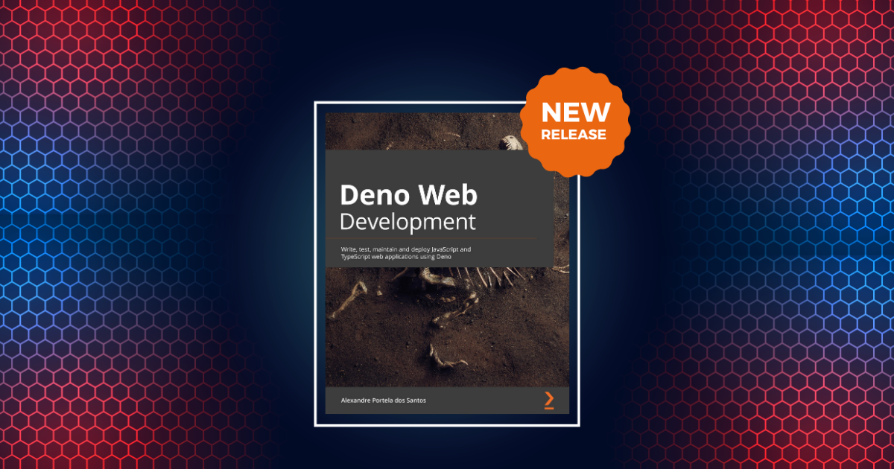

As some of you might know, I've been working on something for the last six months -- a book! 

Presenting [Deno Web Development](https://www.amazon.com/gp/product/180020566X), a book about [Deno](https://deno.land), a secure runtime for JavaScript and TypeScript, and how to use it for web development.

The book focuses on how you can write, test, maintain, and deploy JavaScript and TypeScript web applications using Deno. 

## The approach

It is a guided journey discovering this new runtime, understanding the reasons for its creation, what problems it solves, and how to use it to build a real-world application. 

The book starts with "hello world" and finishes with an API deployed in a cloud environment. In the meantime, it covers topics such as dependency and configuration management, connecting with the database, structuring an application, testing, among many others. 

## What to expect

By the end of "Deno Web Development", the reader will have all the knowledge to decide whether to use Deno in their next project. 

As the book progresses, the reader will get to know the ups and downsides of the technology, not only because they're listed there, but also because they'll experience them as they build an application from scratch.

## The audience

I tried to make the book approachable as an introduction to the technology but audacious enough to include many engineering best practices. 

"Deno Web Development" targets people with JavaScript knowledge that want to know more about Deno, understanding how to use it to solve common industry challenges.

## Special thanks

Publishing the book wouldn't be possible without the opportunity offered to me by [Packt](https://www.packtpub.com/)

The same applies to my friends: Felipe, Gonçalo, Bruno, Nuno, János, João, and Miguel. Writing this book wouldn't be possible without your help. Thank you for always being available to discuss a variety of topics and providing meaningful feedback. You're the best! 🙏

And of course, my family and friends for how they encouraged me to follow this "adventure" of joining two of my passions: technology and writing, and writing a book.

## Where can I buy it?

The book is now available globally, on [Amazon](https://www.amazon.com/gp/product/180020566X) in Kindle and paperback versions.

- https://www.amazon.com/gp/product/180020566X
- https://www.amazon.de/gp/product/180020566X
- https://www.amazon.es/gp/product/180020566X
- https://www.amazon.co.uk/gp/product/180020566X

I'd be happy to hear any feedback you have about it, so feel free to reach out to me if you have any questions about it.

If you're curious, I'm thinking of writing a little more on how was the experience of writing the book in the following weeks, adding to what I already said on a previous [interview](https://authors.packtpub.com/interview-with-alexandre-portela-dos-santos/).

Thank you,
