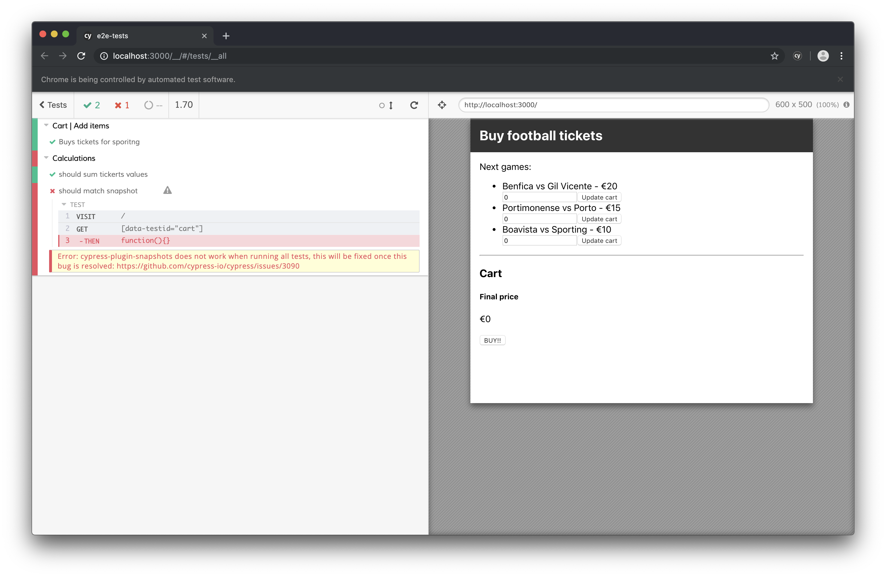
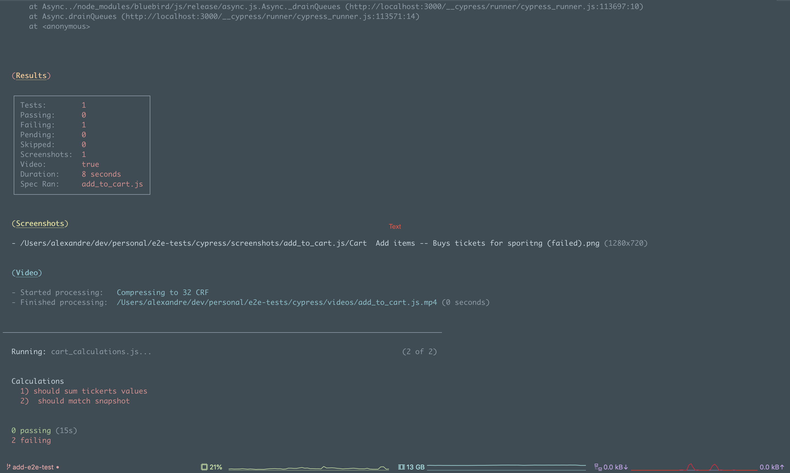
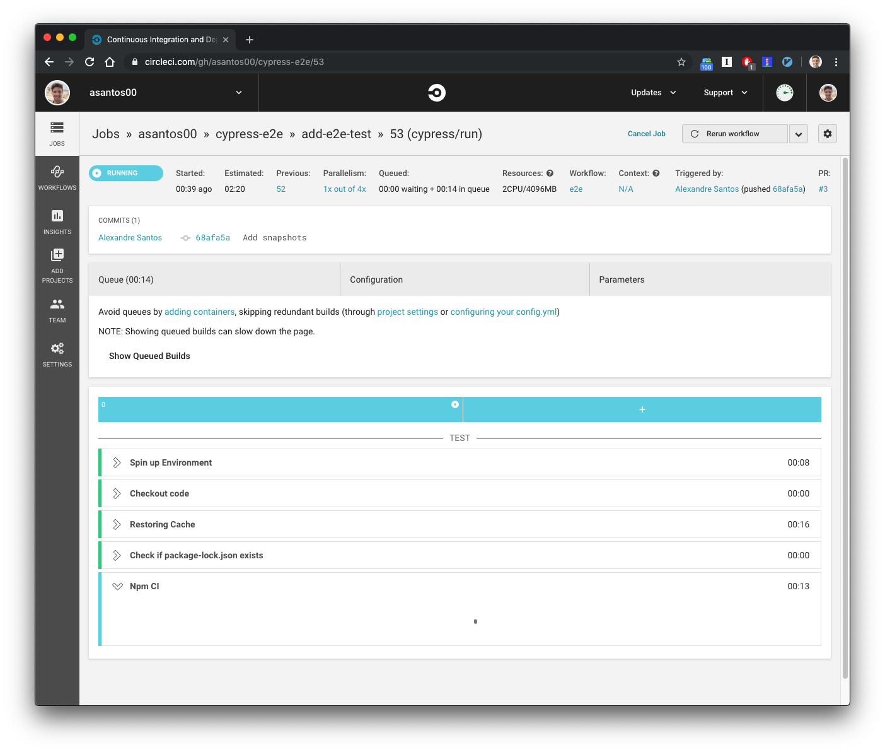

[Slides](https://speakerdeck.com/asantos00/e2e-tests-with-cypress-dot-io) | [Code](https://github.com/asantos00/cypress-e2e)

I've been hearing about [cypress.io](https://cypress.io) for quite a few time, always heard good things, never had the time to try it.

Last week I had the opportunity not only to try but also to implement it to write critical tests on project I've been working.

It worked flawlessly. I was so impressed I messaged a colleague of mine saying:

> "*You have no more excuses not to write e2e tests, cypress makes it so easy that I took one hour to install, test authentication and basic navigation*".

## E2E tests, but why?

It is a normal day, you just open JIRA, grab a task. You think a little bit about it, you open vscode and you start doing it. A couple of hours later your task is pretty much finished. You create your unit and integration tests for the cases you can recall.

Everything seems fine, you push it, open a PR, approved, you merge it!

The QA sees your ticket, tests the flow and everything seems to work. It's Friday which means is "deploy to production day" (we all know it)... you just do it!


Mid-weekend your boss calls you saying that the user can't pay, the button is broken and you are losing money, world is ending 👨‍🚒

Hopefully, none of us will be caught in a situation like this, and I hope to help with this post.

## But I don't want to write them

Now you might be saying something like:

> I've already heard of e2e tests, they're always breaking and they're difficult to write and run. I don't wanna write them.

And **that was my idea**, and unfortunately is the idea that lots of people share. I hope to shake it a little bit by the end of this.

## Cypress

Cypress is a e2e testing framework that runs directly the browser. In my opinion it stands out because of how easy it is to install, write and run tests.

## Demo application

I've built a small demo application where users can buy football tickets for the 3 big teams in Portugal.
You can add tickets to cart, update them, remove from cart, and in the end, you can *buy* the tickets.

The application is deployed [here](https://cranky-stonebraker-09ed2a.netlify.com/) (thanks to Netlify 🙏) if you wanna give it a go.

## Let's write some tests

One of the basic features of my app is adding a number of tickets to the cart. Let's test that one:

**Tip:** Add `/// <reference types="Cypress" />` to the top of your file in vscode to have better autocompletion

```javascript
describe('Cart | Add items', () => {
    it('Buys tickets for sporting',  () => {
        // Visits the root of our application
        cy.visit('/');

        // Searches withing the element that contains 'Sporting'
        cy.contains('Sporting').within(el => {
            // Wraps HTML element in cypress object, to have cypress methods
            cy.wrap(el)
                // Finds input, types 10
                .get('input').type(10)
                // Finds button, clicks
                .get('button').click();
        })

        // Expects for the total value to be on the page
        cy.contains('€100');
    })
})
```

To help writing your tests, we can run `npx cypress open` to open the Cypress UI that allows to run tests separatedly and to see what every command we're writing is doing.




On the side, you can see what every step is doing, as well as the snapshots reflected on the right side.

Let's write one more just to grant that total calculation is not wrong.

```javascript
describe('Cart | Calculations', () => {
    it('should sum tickets values', () => {
        cy.visit('/');

        cy.contains('Sporting').within(el => {
            cy.wrap(el)
                .get('input').type(10)
                .get('button').click();
        })

        cy.contains('Benfica').within(el => {
            cy.wrap(el)
                .get('input').type(10)
                .get('button').click();
        })

        // .get() gets an element by a css selector (class, id, data-attribute, etc)
        cy.get('[data-testid="cart"]')
            .contains(`€300`)
    })
});

```


We're getting quite repetitive with our `addToCart` action, don't you think? Let's write a `Cypress.Command`, open the `cypress/support/commands` file.


```javascript
Cypress.Commands.add('addToCart', (team, nrOfTickets) => {
    cy.contains(team).within(el => {
        cy.wrap(el)
            .get('input')
            .clear()
            .type(nrOfTickets)
            .get('button').click();
    })
})
```


And now refactor our test to use this command


```javascript
describe('Cart | Calculations', () => {
    it('should sum tickets values', () => {
        cy.visit('/');

        cy.addToCart('Sporting', 10);
        cy.addToCart('Benfica', 10);

        cy.get('[data-testid="cart"]')
            .contains(`€300`)
    })
});

```


A little bit better, huh? Let's add a bug to the totalPrice logic and run it in the headless browser


```javascript
// Cart.js

// Before
const totalPrice = allCartKeys.reduce((price, gameId) => {
    return price + cart[gameId] * games[gameId].price
}, 0);

// After (changing the * by /)
const totalPrice = allCartKeys.reduce((price, gameId) => {
    return price + cart[gameId] / games[gameId].price
}, 0);

```

Let's run the tests through the CLI, `npx cypress run`. We'll get the following output:



You probably noticed that Cypress generated a couple of files, `cypress/videos` and `cypress/screenshots`. Just open them and you can see how and why some tests are passing/failing.

## Run it on CI

Let's push this branch and see how it looks on CI



For the case I'm using Circle CI, cypress.io even has a *orb* (it's something like a CircleCI recipe). That already does some things by default. Here's the `./circle/config.yml` using that recommended cypress orb.

`gist:asantos00/7a1c484ac29127865bfc940f8362e1f2`

Notice the `store_artifacts` part of the configuration, it declares what folder should be saved.

After the build complete, you'll be able to see the artifacts on the **Artifacts** section of CircleCI.


## Tradeoffs

As anything, Cypress has tradeoffs, they tell them straight away and do a nice job explaining them in detail [here](https://docs.cypress.io/guides/references/trade-offs.html#Permanent-trade-offs-1). I'm going to list the permanent ones:

- Cypress is not a general purpose automation tool.
- Cypress commands run inside of a browser.
- There will never be support for multiple browser tabs.
- You cannot use Cypress to drive two browsers at the same time.
- Each test is bound to a single origin.

In the above link they explain each one of them in detail. On that same page, the temporary tradeoffs are also listed.

Cross browser support is (gladly) considered temporary, you can see its progress [here](https://github.com/cypress-io/cypress/issues/310)


## Conclusion

Cypress has, IMHO, in its APIs one of its best features. To me, the API and the ease of install is definitely something that makes it stand out from the rest.

The fact the you can just `npm install` and start writing/running tests is amazing. Adding to that, the UI tool also helps  a lot debugging and developing new test cases.

To finish and this is probably more of an personal taste, I found the API is so clean, tests are pretty easy to read and navigate, making it a good place for starters when onboarding on a project.

What do you think about Cypress, have you used it?

I would love to hear your opinion and experience as well as any questions/feedback you have about this post. Feel free to reach out to me!

### More related

- [Cypress plugins](https://docs.cypress.io/guides/tooling/plugins-guide.html#Use-Cases)
- [Visual testing](https://docs.cypress.io/guides/tooling/visual-testing.html#Functional-vs-visual-testing)
