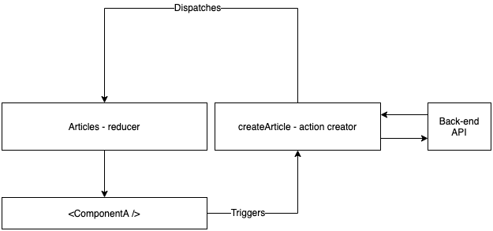
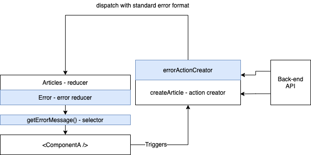

Error handling is a hard subject. It is also not fun, you just don't wanna do it. At the same time you know it is crucial for good user experience. You can try to forget about them, and use common excuses like "this is not very likely to fail", "errors will not happen". Or a more bold, cowboy style phrase like "my code has no bugs" 🤠.

Let me remind you of _Murphy's law_:

> Anything that can go wrong will go wrong

Trust me, and trust Murphy, it will go wrong. Worse experience than having errors happening is having your user being completely unaware of them and thus not able to react or report.

# Error codes format

Pretty much all applications that are bigger than a simple exercise need to deal with errors. If you have an application that does HTTP requests, you know you will end up having to store your HTTP errors somewhere to show them to the user.

We will focus on the strategy we believe to be good to deal and communicate errors to the user.

The first thing we did was to align with the back-end an error format, we ended up with this.

```json
{
  "errorCode": "1001",
  "errorMessage": "Validation error has occurred.",
  "errors": {
    "description": "Must not be null",
    "name": "Must not be null"
  },
  "errorTimestamp": "2020-03-06T08:14:03.690Z"
}
```

`errorCode` is an internal error code the user can use to report the specific error

`errorMessage` describes the error and is shown to the user, it will later become an i18n code.

`errors` is an object that describes the errors on the payload that was sent before

`errorTimestamp` is the timestamp of this response

# Integrating errors in reducers and components

As we said before, _error handling is not fun_. We want to make it _as simple as possible_ so we're sure the error coverage is easy to increase across the application.

To provide this, we decided to go to a composable solution that can be used in _reducers, action creators, and selectors_.

If you're not familiar with redux terms, here's a TLDR (feel free to skip if you are):

- _reducers_ define how your state is mutated. Based on an action (think an event) and on the current state, they know how to calculate the next state.

- _action_ is similar to an _event_ that is sent to the store to trigger a state change

- _action creators_ are functions that create actions

- _selectors_ are no more than _getters_ to a store, enabling decoupling of the store from its users

The examples we've used are written in `react`, `redux` and `reselect`, but the practices and principles used are technology agnostic.

## Before - the default way

Let's create an HTTP request and write the error handling approach.

We will use [redux-thunk](https://github.com/reduxjs/redux-thunk) as we believe they're simpler to understand. If you're not familiar with them: they are functions that produce side-effects and dispatch actions.

```js
import axios from "axios"

const createArticle = (title, text) => dispatch => {
  dispatch({ type: "CREATE_ARTICLE_REQUEST" })

  return axios
    .post("/api/articles", { title, text })
    .then(successHandler)
    .catch(error => {
      // Deal with the error
      dispatch({ type: "CREATE_ARTICLE_ERROR", error })
    })
}
```

Then, in the _reducer_, the handling would be something like:

```js
const reducer = (state, action) => {
  switch (action.type) {
    case "CREATE_ARTICLE_REQUEST":
      return {
        ...state,
        isLoading: true,
        error: null, // reseting the error
      }
    case "CREATE_ARTICLE_ERROR":
      return {
        ...state,
        error: action.error, // setting the error
      }
  }
}
```

And on your components, you would do something like the following to show the error to the user:

```js
import { useSelector } from "react-redux"

const ArticleListPage = () => {
  const errorMessage = useSelector(state => state.articles.error.errorMessage)
  return (
    <div>
      {error && <p>There was an error: {errorMessage}</p>}
      {/* Cut for brevity */}
    </div>
  )
}
```

This is a default thunk, dispatching actions at the start of the request, on success and error.

We have identified some problems with this approach:

- There is **no enforced error structure**. One developer can send `error` in the action where others can directly send `error.errorMessage`

- The code to handle errors on reducers will be **repeated for every request** and can end up not respecting the structure too.

- If the reducer, action creator or component change, **it is very likely that the other 2 will break**, they are coupled. `Can't access property 'errorMessage of undefined` I'm looking at you.

- Error messages are shown in different formats across the application leading to a **not so pleasant user experience**.

## After - How to solve these problems?

Let's have a look at the code again:

```js
import axios from 'axios;

const createArticle = (title, text) => dispatch => {
  dispatch({ type: "CREATE_ARTICLE_REQUEST" })
  return axios
    .post("/api/articles", { title, text })
    .then(successHandler)
    .catch(error => {
      // Deal with the error
      dispatch(errorActionCreator("CREATE_ARTICLE_ERROR", error))
    })
}
```

errorActionCreator implementation that respects [FSA](https://github.com/redux-utilities/flux-standard-action)

```js
export const errorActionCreator = (errorType, error) => {
  return {
    type: errorType,
    error: true,
    payload: error,
  }
}
```

Then, in the _reducer_, the handling would be something like:

```js
const reducer = (state, action) => {
  switch (action.type) {
    case "CREATE_ARTICLE_REQUEST":
      return {
        ...state,
        ...errorReducer(state, action),
        isLoading: true,
      }
    case "CREATE_ARTICLE_ERROR":
      return {
        ...state,
        ...errorReducer(state, action),
        isLoading: false,
      }
  }
}
```

errorReducer implementation

```js
export const errorReducer = (state, action) => {
  if (!action.error) {
    return {
      ...state,
      error: null,
    }
  }

  return {
    ...state,
    error: {
      errorMessage: DEFAULT_ERROR_MESSAGE,
      ...action.payload.response.data,
    },
  }
}
```

And on your components, you would do something like the following to show the error to the user:

```jsx
import { useSelector } from 'react-redux';
import { getArticlesErrorMessage } from '../store/articles/selectors';

const ArticleListPage = ({ errorMessage }) => {
  const errorMessage = useSelector(getArticlesErrorMessage)
  return (
    <div>
      <ErrorMessage message={errorMessage}>
      {/* Cut for brevity */}
    </div>
  );
};
```

Using `ErrorMessage` component to present the error coherently.

```js
export const ErrorMessage = ({ error }) => {
  if (!error) {
    return null;
  }

  return (<p>{error}</p>>);
}
```

To finish, we added this selector that is used by components to get error messages.

```js
const getArticlesErrorMessage = createErrorSelector(state => state.articles)
```

The implementation of `createErrorSelector` is shown below, it extends `reselect` `createSelector` to lookup for the error in the specific structure we want.

```js
import { createSelector } from "reselect"
import { get } from "lodash"

export const createErrorSelector = fn => {
  return createSelector(
    fn,
    storeIndex => get(storeIndex, "error.errorMessage", null)
  )
}
```

With this approach, we managed to fix all the listed problems. We have created a layer of decoupling that enables us to change without breaking all the other usages.

- Enforced error structure

- Error reducer is shared

- Decoupled reducers and components from errors format

- Error messages are shown coherently

We've decided to locate the 3 functions: `createErrorSelector, errorReducer` and `errorActionCreator` in the same file. If one of them needs to be changed, it most likely means that the other two also need to. In contrast, all the _reducers_, _components_ and _thunks_ that are dealing with errors can remain intact.

This was the kind of flexibility we aimed to.

## Side by side

**Before**



**After**



In blue are the layers we've added.

## Future improvements

If we decide to add translation codes or to change the error structure that comes from the back-end, we know we will only have to change a single file.

**Writing code that is easy to change** is something we're always aiming for at [KI labs](https://www.linkedin.com/company/ki-labs-lisbon/) and [xgeeks](https://www.xgeeks.io/). Our habitats are fast-changing environments and recently bootstrapped companies that iterate fast. Reach out to use if this is an environment where you would thrive into! 😉

How are you handling your errors in this kind of situation? Have you created something similar? Are you using something automated to deal with error states? How are you displaying them?

I'd love to hear if this solution fixes some of your problems, and if it doesn't, why?

Reach me out via [email](mailto:alexandre.santozz@gmail.com) or [twitter](https://twitter.com/ampsantos0)

Thanks for reading 🙌
