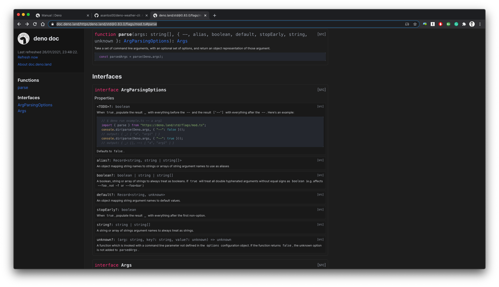

Almost a year ago, in May of 2020, Deno was launched.

It is the outcome of Node's creator (Ryan Dahl) experience of using Node.js after almost a decade of leaving its core team.

Ryan originally created Node.js back in 2012 (check year). Back then, Node brought JavaScript to the server side. Among other things, Node was a paradigm shift in the way many languages handled common tasks, as it heavily used asynchronousity, something familiar among JavaScript users.

It suddently enabled many JavaScript developers knowledge to start building server-side applications. From there, it started being used for HTTP servers, but its usecases never stopped growing, helping make JavaScript today's most popular language.

However, as all the great creations, Node comes with its flaws. And for Ryan, its creator, they were a little itchy, especially when he started using Node again to write simple scripts, after a few years not using it. Ryan felt like he loved the productivity and prototypability of JavaScript, but some parts of Node were now getting in the way.

Out of these learnings, and following the evolution of JavaScript over the last 10 years, Ryan created Deno, which is, as the documentation says:

> A JavaScript/TypeScript runtime with secure defaults and a great developer experience.

We previously explored some of Deno's premises and how it addresses specific Node problems in another article named [My first adventure in Deno land]().

## Goal: compiling to a binary

What we'll do today is exploring one of Ryan's original goals when he first created Deno: compiling JavaScript code into a binary.

As an admirer of golang (which heavily inspired Deno), Node's creator loved the idea of having a complete toolchain as part of the runtime binary (linter, testing suite, dependency manager, and so on). On such a complete toolchain, the capability to build any application into a **single executable binary** couldn't be left out.

Even though this feature was not present on version 1.0.0, back in May of the last year, it was added version 1.5 (add month), and it's been improving since then. By itself, this feature isn't something completely new, as there were a few third-party Node packages that did it before, the main difference is that it's included in the main binary.

This capability proves itself useful in many cases, but today we'll explore one where we think it really shines, building a CLI.

Throughout the rest of the article we will build a CLI application. By the end of the blog post this application will be compiled into a single binary, one you can simply distribute and execute in any machine, without external dependencies.

We'll be doing using Deno's version 1.7.0.

If you to directly jump to the coed, it's available [here](https://github.com/asantos00/deno-weather-cli).

## Developing the functionality

The command line application we will build is one that makes it possible to check how's the weather in any world city.

We'll use OpenWeatherMap (https://openweathermap.org/api) to get the data, and Deno to do all the rest. The code will be written in TypeScript, which is supported natively in Deno without external compilation steps.

The code itself is very straight-forward, as the CLI's job is also quite simple. Here's what it should do:

- Get the name of the city as a CLI flag
- Fetch OWM for the weather data
- Print the data into the console

To do that, we'll use several APIs:

- `Deno.env` to get the environment variable with OWM API key
- Deno's standard-library `parse` function to parse CLI arguments
- ECMAScript 6 `fetch`, available by default in Deno since it's fully compliant with ES6.
- Deno `compile` command to compile the code into an executable binary

This is how the final code will look like. [Check it out on GitHub](https://github.com/asantos00/deno-weather-cli/blob/main/mod.ts).

```ts
import { parse } from "https://deno.land/std@0.83.0/flags/mod.ts";
import { WeatherResponse } from "./types.ts";

const { city } = parse(Deno.args);

const API_KEY = Deno.env.get("OWM_API_KEY");
if (!API_KEY) {
  throw new Error("OWM_API_KEY should be defined");
}

const response: WeatherResponse = await fetch(
  `https://api.openweathermap.org/data/2.5/weather?q=${city}&appid=${API_KEY}`,
).then((r) => r.json());

console.log(`Weather for ${city}: ${response.weather.map((entry) => entry.main)}
Temperature:
  Max: ${response.main.temp_max}
  Min: ${response.main.temp_min}
  Feeling: ${response.main.feels_like}
Wind:
  Speed: ${response.wind.speed} km/h
`);
```

*Note: We're using OWM API version 2.5*

If the imports still look strange to you (even though they are fully browser compatible), we explained them more in detail, in the previous article [Adventures in Deno land]().

Put simply, Deno makes it possible for any JavaScript/TypeScript package with a HTTP URL to be **directly imported**.

## Documentation

Any questions regarding the available APIs, or how they work is delighfully explained in Deno's documentation (https://doc.deno.land/).

As Deno supports directly importing modules by URL, the documentation isn't any different. By using the provided URL (https://doc.deno.land) plus the URL to a package, we get a beautifully designed page with the package types and documentation.

For instance, to check `parse` documentation we just need to navigate to https://doc.deno.land/https/deno.land/std@0.83.0/flags/mod.ts#parse, and this is what we get.



For the builtin functions, which include everything that's made available by JavaScript itself (`fetch`, `setTimeout`, `window`, and so on) and the Deno namespace functions (like the `Deno.env.get`), we can use https://doc.deno.land/builtin/stable.

## Executing the code

After having Deno installed on the system, executing the code is the simplest of tasks. We can just use `deno run` plus the path to the file we want to execute (in our case we've called it `mod.ts`).

*To be able to get the program to run, we'll need Open Weather Map API, which you can get [here](https://openweathermap.org/api)*

```bash
$ OWM_API_KEY=<APIKEY> deno run mod.ts --city Leiria
```

*If you tried executing the above line, you might be getting some errors, here's why:*

As we mentioned in a previous article, Deno's programs run in a sandbox. This feature makes all Deno programs safe by default, by not giving them any access to the underlying system.

For programs that need to access specific features, like our Weather CLI, those permissions have to be explicitly sent.

In our case we'll use `--allow-net` and `--allow-env` to give access to the network and the environment.

```bash
$ OWM_API_KEY=<APIKEY> deno run --allow-env --allow-net=api.openweathermap.org mod.ts --city Leiria
Weather for Leiria:
Clouds
Temperature:
  Max: 288.15
  Min: 287.59
  Feeling: 288.97
Wind:
  Speed: 0.75 km/h
```

And that's it! The program is doing what it needs to.

The next step is to start sharing it with our fellow developers so that they can easily check how's the weather in their city. We're just missing the binary. Let's do it.

## Compiling into a binary

As we get close to the final goal of this post, we'll explore how to compile the code we just wrote into a binary.

We'll use `deno compile` command for that. Please keep in mind that even though it works, this is still an *unstable* feature, and thus subject to possible bugs and changes.

```bash
$ deno compile --unstable --allow-env --allow-net --output=weather mod.ts
Check file:///Users/alexandre/dev/personal/deno/weather/mod.ts
Bundle file:///Users/alexandre/dev/personal/deno/weather/mod.ts
Compile file:///Users/alexandre/dev/personal/deno/weather/mod.ts
Emit weather
```

And it emmited a binary named `weather`! Note how we're sending the permission flags (`--allow-env` and `--allow-net`) to the `compile` command, guaranteeing that the generated binary has permission to access what it needs.

We can now share this binary with whoever we want, and execute it directly.

```bash
OWM_API_KEY=<API_KEY> ./weather --city Leiria
Weather for Leiria: Clouds

Temperature:
  Max: 288.15
  Min: 287.59
  Feeling: 288.97
Wind:
  Speed: 0.75 km/h
```

This achieves our goal for this blogpost. We've explored Deno's ease of use and especially the capability to build JavaScript code into a binary.

What you just read is part of a series of blogposts where we explore multiple Deno functionalities from interoperability with Rust to static site generation, among others.

## Conclusion

Today we've grasped the surface on one of the many possibilities Deno opens.

We truly believe that, by building on the shoulders of giants (Node.js and Rust) and adding a few things to the mixture, Deno has all it takes to stand out.

Deno completely leverages JavaScript and makes it very easy for developers to build from simple programs to complete applications, and this is what's exciting us.

If you're interested in knowing more about Deno and how to use it to build tools and web applications, make sure you checkout my recently launched book [Getting started with Deno](). In the book, we'll carefully explain all the mentioned Deno features (and many others) while building real-world applications.

This article (and the code) was co-written by me my friend [Joni Oliveira]() from whom I deeply appreciate the support and constant enthusiasm in learning new things.

If you have any questions or things you'd like to see explored, make sure you it us on Twitter, Medium or LinkedIn.
