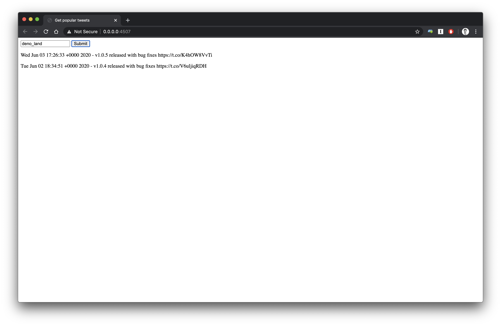

On my last post, I wrote about [my first adventure in deno.land](https://alexandrempsantos.com/adventures-in-deno-land/). I have to say it was a fun one. That excitement of trying some new technology was always there. It ended with me think about new possibilities and tools and asking what am I going to build with it.

Last time I built a small twitter bot, without any libraries, to scratch the surface of the standard library, and to get to know _deno_ a little better in a context that is not an overly simplistic "hello world".

It was very well-received, way more than what I was expecting. It ended up being, to the time, my most read and reacted post ever. I guess I got quite lucky on the "deno hype train".

Back to what brought me here today, after exploring the standard library, module imports, simple permission system and dependency management. Today I'll go around the following topics:

- Lock files
- Official VSCode extension
- Documentation generation
- Permission system -- a tip
- Running _deno_ code in the browser
- Testing

If you want to follow the code, [here you have it](https://github.com/asantos00/deno-twitter-popular).

## Lock files

To complete the information from the last post about dependencies, I'll write about lock files. They're a standard practice in many languages in pretty much every production app. They're used to describe an exact tree of dependencies, in order to make installations more repeatable, avoiding issues that may arise out of version misalignement.

In _deno_ you can generate a lock file for the used dependencies by running

```bash
deno cache --lock=lock.json --lock-write ./src/deps
```

This command will _cache_ (that local installs the used dependencies) based on a `lock.json` file. The `--lock-write` flag updates or creates the `lock.json` file. The last parameter is the file that uses the dependencies.

To install the dependencies while integrity checking every installed resource, one can run:

```bash
$ deno cache -r --lock=lock.json deps.ts
```

The [generated file](https://github.com/asantos00/deno-twitter-popular/blob/master/lock.json) is no more that a json object of dependencies and a checksum

## VSCode extension

The official vscode extension is launched! However, it is the exact same that I talked about last time. It was just moved to the official repo, as the changelog states

> Moved from https://github.com/justjavac/vscode-deno to https://github.com/denoland/vscode_deno in order to have an "official" Deno plugin.

It works very well, autocompletes and files imports are fine, as expected. There's a small problem though, when you cmd + click on external dependencies, it does not detect the language, so the file appears without any highlighting.

I'm sure it will be fixed soon but it's also a good **oportunity for contribution** that I might take, after I get the time to understand the code from vscode and the plugin itself.

## Documentation

Another of the advantages presented by Ryan in his talk was that deno included a documentation generator on its toolchain. It doesn't have (yet) a section on the website, but we'll explore it a bit here.

### Browse modules documentation

Even though deno has no `install` step, the `cache` lets you develop in an airplane (as you did with `node_modules`), as it loads the modules the first time and then uses the cached one.

While working on an airplane, what if you want to look at third party code docs? You can use your editor of choice, yes, but there's an alterantive.

_deno_ provides a cool way to see the third party code documentation without having to browse the code.

```bash
$ deno doc https://deno.land/std/http/server.ts
```

This outputs the methods exposed by the standard library's http server.

```ts
function listenAndServe(addr: string | HTTPOptions, handler: (req: ServerRequest) => void): Promise<void>
  Start an HTTP server with given options and request handler

function listenAndServeTLS(options: HTTPSOptions, handler: (req: ServerRequest) => void): Promise<void>
  Start an HTTPS server with given options and request handler

function serve(addr: string | HTTPOptions): Server
  Create a HTTP server

function serveTLS(options: HTTPSOptions): Server
  Create an HTTPS server with given options

class Server implements AsyncIterable

class ServerRequest

interface Response
  Interface of HTTP server response. If body is a Reader, response would be chunked. If body is a string, it would be UTF-8 encoded by default.

type HTTPOptions
  Options for creating an HTTP server.

type HTTPSOptions
  Options for creating an HTTPS server.
```

Very neat, right? A very nice way of having an overview of the modules exported symbols.

To see the documentation for a specific symbol, one can also run.

```bash
$ deno doc https://deno.land/std/http/server.ts listenAndServe
```

Which outputs

```ts
function listenAndServe(addr: string | HTTPOptions, handler: (req: ServerRequest) => void): Promise<void>
    Start an HTTP server with given options and request handler
        const body = "Hello World\n";     const options = { port: 8000 };     listenAndServe(options, (req) => {       req.respond({ body });     });
    @param options Server configuration @param handler Request handler

```

You can use the documentation command to have an overview of your code's exported modules, it works the same way.

```bash
$ deno doc twitter/client.ts
```

Output:

```ts
const search
  Searches for the recent tweets of the provided username that have more than 5 likes

interface Tweet
  Fields in a tweet

interface TweetResponse
  The response from Twitter API
```

The `--json` flag is also supported (however, not for symbols), and allows generating the documentation in the json format, enabling programmatic uses.

One great example of the documentation generation uses is _deno_ [runtime API](https://doc.deno.land/https/github.com/denoland/deno/releases/latest/download/lib.deno.d.ts).

It uses Deno to generate modules with the `--json` command and provides a really nice layout around it. We just needed to add `typedoc` to our modules, like what we did [here](https://github.com/asantos00/deno-twitter-popular/commit/dbac72b58f46ace067381cbdfc5708877b033aac#diff-8575744caf69ee401aa128c0f0d46a42R71).

## Fine grained permissions

As we talked [on my previous post](https://alexandrempsantos.com/adventures-in-deno-land/), one thing that _deno_ got very well were permissions. They're easy to use and secure by default. Previously, I've explained that in order for a script to be able to access the network, for instance, you'd have to explicitly use `--allow-net` flag when running it.

That is true, however, I was alerted by my friend [Felipe Schmitt](https://twitter.com/schmittfelipe) that in order for it to be stricter, we can use:

```
deno run --allow-net=api.twitter.com,0.0.0.0 index.ts
```

This will, as you probably guessed, allow network calls to `api.twitter.com` and from `0.0.0.0` but disallow all the other calls. Instead of allowing complete access to network, we're allowing just part of it, whitelisting and blocking everything else by default.

This is now very well explained on the [Permissions page](https://deno.land/manual/getting_started/permissions.), which is one of the documentation improvements that were added after the v.1.0.0 launch.

## Running code in the browser

Another very interesting feature of _deno_, is the `bundle` command.

It allows us to bundle your code into a single `.js` file. That file can be run as any other deno program, with `deno run`.

What I find interesting is that the generated code, when it doesn't use the `Deno` namespace, is that it **can run on the browser**.

The possibilities for this are limitless. For instance, what if I wanted my API to generate an HTTP client for frontends to interact with it?

We can write that client in _deno_, reusing API code (and types). Here's the code to get the popular tweets.

```ts
// client/index.ts
import { TweetResponse } from "../twitter/client.ts"

export function popular(handle: string): Promise<TweetResponse> {
  return fetch(`http://localhost:8080/popular/${handle}`)
    .then(res => res.json())
    .catch(console.error)
}
```

This code lives on the API codebase, (and it is written in _deno_). It uses the same types from the twitter client the API uses.

Having the API client living on the API codebase means that whoever updates the API can also update the client, abstracting the backend and API changes from the frontend code. This is not a _deno_ feature but something that it enables.

Then, we can run the `bundle` command and put the generated file in a folder.

```bash
$ deno bundle client/index.ts public/client.js
```

It will generate the `client.js` file that is able to be run in the browser. For demonstration purposes we can create a `public/index.html` file with the following code.

```html
<script type="module">
  // Imports the generated client
  import * as client from "./client.js"

  async function fetchTwitter(event) {
    // Uses the methods on it
    const result = await client.popular(event.target.value)

    /*
      Omitted for brevity
    */
  }
</script>
```

[This is the file on GitHub](https://github.com/asantos00/deno-twitter-popular/blob/master/public/index.html)

Which uses the client that was initially written in deno, and is now a js file.

Now, this `public` folder can be served by any webserver. Since we're talking about _deno_, we can take advantage of it and serve the files with standard library's file server.

```bash
# inside the public folder
$ deno run --allow-net --allow-read https://deno.land/std/http/file_server.ts
```

We can now visit `http://0.0.0.0:4507/` and use our very archaic frontend to query for popular tweets. With this, our code can use the client that was **originally written in deno** on the frontend, to interact with the API.



## Testing

Following _deno_'s goal of shipping the essentials in a single binary, testing is obviously included. The documentation is, again, quite good on this. With the help of the `doc` command, it gets very straight-forward to write tests.

```bash
$ deno doc https://deno.land/std/testing/asserts.ts
```

This prints the documentation for the assert module from _deno_ standard library

```ts
function assert(expr: unknown, msg): <UNIMPLEMENTED>
  Make an assertion, if not `true`, then throw.

function assertEquals(actual: unknown, expected: unknown, msg?: string): void
  Make an assertion that `actual` and `expected` are equal, deeply. If not deeply equal, then throw.

function assertMatch(actual: string, expected: RegExp, msg?: string): void
  Make an assertion that `actual` match RegExp `expected`. If not then thrown

/* Cut for brevity */

function fail(msg?: string): void
  Forcefully throws a failed assertion

```

Let's write a simple test to our "isomorphic" client we created a few lines above.

`Deno.test` will be used to declare the test body, `assertEquals` will be called to make the assertion. In order to mock the server responses, we'll spin up a server using standard-library _http_server_.

We expect that, the `popular` method from the client calls `/popular/:twitterHandle`, let's create a test for that.

```ts
import * as ApiClient from "./index.ts"
import { assertEquals } from "../deps.ts"
import { runServer } from "../util.ts"

Deno.test("calls the correct url", async () => {
  runServer(async req => {
    assertEquals(req.url, "/popular/ampsantos0")
    await req.respond({ body: JSON.stringify({ statuses: [] }) })
  })

  await ApiClient.popular("ampsantos0")
})
```

Our `runServer` util is a very simple function that just spawns a web server that closes after the first connection.

```ts
import { serve, ServerRequest } from "./deps.ts"

export const runServer = async (
  handler: (req: ServerRequest) => Promise<any>
) => {
  const server = serve(":8080")

  for await (const req of server) {
    await handler(req)
    server.close()
  }
}
```

We can now run the test. Remember that everytime we run a _deno_ program we need to pass the permission flags.

It will run as test every file matching the following regex `{*_,*.,}test.{js,ts,jsx,tsx}:`.

**TLDR**: It runs every file that has `test` in its name and ends with one of the mentioned file extensions.

```bash
$ deno test --allow-net
```

If the test is failing, we're presented with a nice diff.

```ts
test calls the correct url ... error: Uncaught AssertionError: Values are not equal:

    [Diff] Actual / Expected


-   "/popular/ampsantos0"
+   "/popular/handle-that-doesnt-work"

  throw new AssertionError(message);
        ^
    at assertEquals (https://deno.land/std/testing/asserts.ts:170:9)
    at file:///Users/alexandre/dev/personal/deno/testing-deno/client/index.test.ts:7:5
    at runServer (file:///Users/alexandre/dev/personal/deno/testing-deno/util.ts:9:11)
```

In order to run just part of the tests, the `--filter` flag can be used.

```bash
$ deno test --allow-net --filter="correct url"
```

And a path can also be sent as the last argument

```bash
$ deno test --allow-net ./client
```

You can follow all the listed changes related to tests on [this commit](https://github.com/asantos00/deno-twitter-popular/commit/14b7a623ac84d689f9e9872685b93cd6bd138a9c).

And with this, we have pretty much everything we need in order to write compreensive tests. Again, the essentials are there, we can (and probably will) create a couple more test utilities composing on top of the standard library, but for simple tests as the one we just wrote, this is enough.

## Conclusion

On our second adventure, we went a little further than just presenting the language.

We explored some other parts of the runtime. From testing, generating documentation, lock files, stricter permissions, to generating javascript code and running it on the client. All of them features we considered useful when writing _production_ code.

We can't forget that we did all of this with the toolset that is **included** in _deno_, no libraries were used.

To me, this doesn't mean that developers will not use libraries (of course). It means though that the standard library is very well written and easy to use. This opens the potential for developers to write powerful abstractions on top of it.

Together with the standard library, the toolchain offered with the main binary proves itself very complete, aligned the goal of _Only ship a single executable_, mentioned on _deno_ docs.

There's though a missing that I might write a very small article about -- benchmarks, but that's for another adventure.

This adventure took a little longer that expected. Thanks for reading it.

I hope it was as fun reading as it was for me exploring it. I'd love to hear what you have to say about it and answer all the questions you might have.
