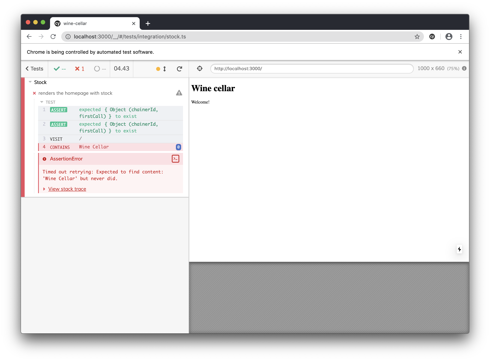
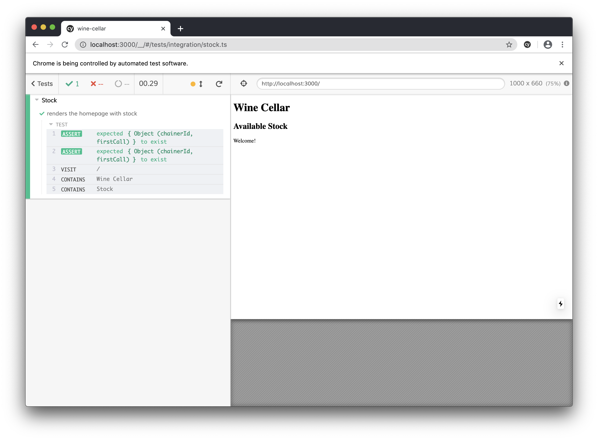
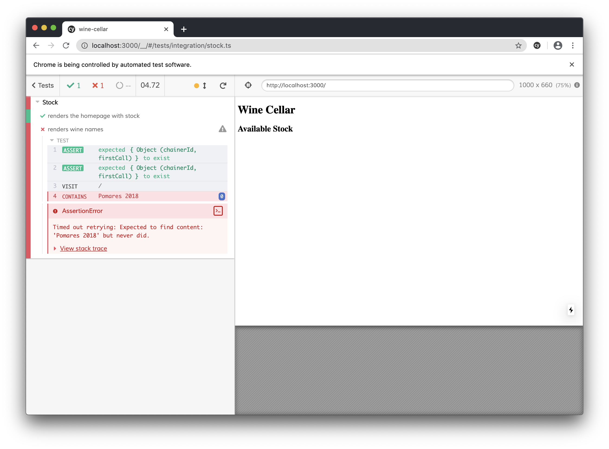
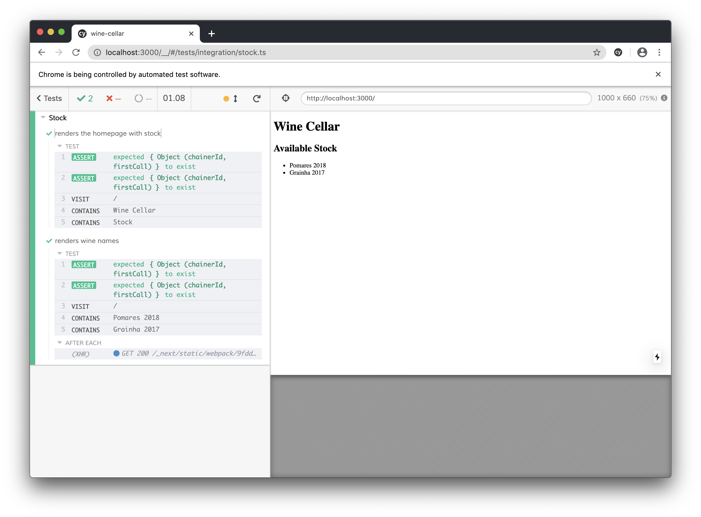

A few months ago I finished reading [Growing Object-Oriented Software, Guided by Tests](http://www.growing-object-oriented-software.com/). I have to confess that before I started I thought it was just one more book about TDD.

I had read a couple of books and articles about this and at the end, my thought was always:

> TDD does not apply to my use case

This book changed my mind. Interestingly, the authors pointed my main thought as one of the biggest misconceptions that is about TDD, that kept me engaged.

Everytime I tried to write tests first before reading the book, I always had 2 main thoughs while trying to adopt TDD:

- I can't write **all the tests upfront**, that's impossible
- I can write the tests afterwards and still **not be biased**, it is the same thing, right?

Both these assumptions are wrong in some way.

## Why TDD

A lot was written about TDD and it's advantages, I'll not write them again. Just name a few that I'm trying to make clear on this blogpost.

- Interface first design - Start from requirements and go towards the implementation
- You only build what you need - Not more, not less
- Short feedback loops - Your code always compiles and runs
- Write small chunks of code that work

At the end of the day, TDD encourages a lot of what's considered to be good software design practices.

# Building the app

## What are we going to build?

As a wine lover, I want to create an app to keep a list of my favorite wines. 🍷

Let's code to satisfy the following **user story**

> User can see the wine cellar current stock in the homepage

The examples will be presented in react (using nextjs) and typescript. To test it uses cypress for acceptance tests and jest plus react-testing-library for unit tests. However, all the blogpost is more focused on the practices and patterns that are universal, not tight to specific technologies.

If you want to follow the code, [here you have it](https://github.com/asantos00/wine-cellar).

# Enough with the words, show me the code!

To start, we should demystify a very common myth on TDD: **No, we are not writing all the tests upfront**.

We should go in small cycles, writing tests and functionality bit by bit.

> Write the simplest meaningful test possible

You might be asking _"What type of test? Acceptance? Unit?"_. Fair question.


The above image explains what will be the common flow when developing on TDD. We write a failing high-level test first, and we start the design and imlpementation, writing unit tests along the way to help us.

You gotta think of this the following way:

> Outer loop helps business, inner loop helps developers.

This means all acceptance tests should test something meaningful to the business, and unit tests are lower level and closely related to code. A passing unit test probably means very little to the app's purpose.

Acceptance tests normally take more time to pass, they normally require a feature chunk to be implemented. Unit tests should be quick to go from failing to passing.

## 1. Writing the first acceptance test

**User story:**

> User can see the wine cellar current stock in the homepage

We want to start testing very simple stuff:

- Homepage / renders the current stock

```js
// cypress/integration/stock.js

describe("Stock", () => {
  it("renders the homepage with stock", () => {
    cy.visit("/")

    expect(cy.contains("Wine Cellar")).to.exist
    expect(cy.contains("Stock")).to.exist
  })
})
```

And we have the first failing test



Let us make it pass by editing `pages/index.tsx`.

```js
// pages/index.tsx
export default function Home() {
  return (
    <div>
      <h1>Wine Cellar</h1>
      <h2>Available Stock</h2>
      <main>
        <p>Welcome!</p>
      </main>
    </div>
  )
}
```



And we have our test passing!

We can go back and code the whole page at once! Or maybe not... Shouldn't we try to write the test first?

Let's keep faithful to the _golden rule of TDD_

> Never write a new functionality without a failing test

## 2. A failing acceptance test

We want to see a list of wines from our cellar, but it currently presents nothing. Our next task is to write a test for that.

We know that to get the list of wines, an API request has to be done.

To be able to mock HTTP requests for testing purposes we added [miragejs](https://miragejs.com/). It is an HTTP mocking library that can be used to develop and test an application without an API by mocking the network requests.

Setting up miragejs with cypress is very easy, you can check it out the [link on miragejs documentation](https://miragejs.com/quickstarts/cypress/).

Back to our test, we write the HTTP mocking logic returning a list of wines. After this we expect the wines to be presented on the screen.

```js
// cypress/integration/stock.ts

import { Server } from "miragejs";
import { makeServer } from "../../makeServer";

let server: Server

beforeEach(() => {
  server = makeServer({ environment: "test " })
})

afterEach(() => {
  server.shutdown()
})

it("renders wine names", () => {
  cy.visit("/")

  server.get("/wines", () => [
    { name: "Pomares", year: 2018 },
    { name: "Grainha", year: 2017 },
  ])

  expect(cy.contains("Pomares 2018")).to.exist
  expect(cy.contains("Grainha 2017")).to.exist
})
```

And we're back with our failing test.



## 3. Start writing the feature

Now that we have a meaningful failing acceptance test. We can focus on the feature we want to develop until it turns green again.

We want to develop a page that requests an API for wines and displays it on the screen.

### 3.1 API Client

To not write the HTTP logic inside our components, we need an API client.
What do we need from the API client to do? It must have a `getWines` method that returns the list of wines in stock. We'll use singleton pattern for simplicity.

As we said, _acceptance tests help the business, unit tests help the developer_. Since we're writing the API client module, a **unit test** is a very good fit.

Before we start running the test, we should get the watch mode running. `npm run test:watch`

```ts
// services/api.test.js
import { getWines } from "./api"
import axios from "axios"

jest.mock('axios');

afterEach(() => jest.clearAllMocks());

it("should do a http request to /wines", () => {
  axios.get = jest.fn()

  getWines()

  expect(axios.get).toHaveBeenCalledWith("/wines")
})
```

To have this test running, we also need to declare and export a `getWines` dummy method on our `api.ts` file otherwise the code will not compile due to the export not being defined.

```js
// services/api.ts
export const getWines = () => null;
```

And this is the result

```
 FAIL  services/api.test.ts
  ✕ should do an HTTP request to /wines (3ms)

  ● should do an HTTP request to /wines

    expect(jest.fn()).toHaveBeenCalledWith(...expected)

    Expected: "/wines"

    Number of calls: 0

       8 |   getWines();
       9 |
    > 10 |   expect(axios.get).toHaveBeenCalledWith('/wines');
         |                     ^
      11 | })
      12 |

      at Object.<anonymous> (services/api.test.ts:10:21)

Test Suites: 1 failed, 1 total
Tests:       1 failed, 1 total
Snapshots:   0 total
Time:        1.996s
Ran all test suites related to changed files.
```

A failed test, no surprises. What should we do next? The tests **are guiding us** by saying `axios.get` wasn't called.

Let's go to the API client method that should be doing a `GET` request, on the `services/api.ts` file.

**Suggestion**: Keep a window on the side with our test watch command running.

```js
// services/api.ts
import axios from 'axios';

export interface Wine {
  name: string,
  year: number
}

export const getWines = () => {
  return axios.get<Wine[]>('/wines')
    .then(({ data }) => data)
}

```
And suddenly, we have our unit test suite passing!

```
 PASS  services/api.test.ts
  ✓ should do a HTTP request to /wines (2ms)

Test Suites: 1 passed, 1 total
Tests:       1 passed, 1 total
Snapshots:   0 total
Time:        0.366s, estimated 1s
Ran all test suites related to changed files.

Watch Usage: Press w to show more.

```

How's our acceptance suite? It's still failing. Remember we said unit tests are faster to pass than acceptance? We'll get there.


### 3.2 Displaying the wines list

Now that we have coded our _very simple_ API client. We want to use it in our component and make sure it tries to do the request when it mounts.

The first step is to create a **unit test** for that.

```js
// pages/index.test.tsx
import { render } from "@testing-library/react"
import { Home } from "./index"
import * as Api from "../services/api"

it("tries to get wines", () => {
  const getWines = jest.fn()

  // @ts-ignore
  Api.getWines = getWines
  // ts-ignore is needed to be able to mutate the `readonly` property

  render(<Home />)

  expect(getWines).toHaveBeenCalled()
})
```

As `jest` automatically re-runs the test, the error is pointing us to the next step of the implementation that is missing.

```
 PASS  services/api.test.ts
 FAIL  pages/index.test.tsx
  ● tries to get wines

    expect(jest.fn()).toHaveBeenCalled()

    Expected number of calls: >= 1
    Received number of calls:    0

       7 |   render(<Home getWines={getWines} />)
       8 |
    >  9 |   expect(getWines).toHaveBeenCalled();
         |                    ^
      10 | })
      11 |

      at Object.<anonymous> (pages/index.test.tsx:9:20)

Test Suites: 1 failed, 1 passed, 2 total
Tests:       1 failed, 1 passed, 2 total
Snapshots:   0 total
Time:        5.496s
Ran all test suites related to changed files.

```

Going back to `pages/index.tsx`. Let's add the functionality to call `getWines` after the mount.

```js
import { getWines } from "../services/api"
import { useEffect } from "react"

function Home() {
  useEffect(() => {
    getWines()
  }, [])

  return (
    <div>
      <h1>Wine Cellar</h1>
      <h2>Available Stock</h2>
      <main>
        <ul></ul>
      </main>
    </div>
  )
}

export default Home
```

And the test is **green**! `getWines` is being called after the render, our component is doing what is expected!

```
 PASS  services/api.test.ts
 PASS  pages/index.test.tsx

Test Suites: 2 passed, 2 total
Tests:       2 passed, 2 total
Snapshots:   0 total
Time:        1.663s
Ran all test suites related to changed files.

Watch Usage: Press w to show more.
```

What's missing? By looking at our acceptance test, wines are still not being shown, but we're almost there.


We need to deal with the response and render it to the screen.

Adding another test.

```js
import { render, waitFor } from 'react-testing-library';

it('renders wines coming from client', async () => {
  const getWines = jest.fn().mockResolvedValue([
    { name: 'Douro', year: 2019 },
    { name: 'Alentejo', year: 2020 }
  ]);

  // @ts-ignore
  Api.getWines = getWines;

  const { getByText } = render(<Home />)

  // waitFor should be used to wait for async operations
  await waitFor(() => {
    expect(getWines).toHaveBeenCalled();
    expect(getByText('Douro 2019')).toBeTruthy();
    expect(getByText('Alentejo 2020')).toBeTruthy();
  })
})
```

Guess what? It is failing.

```
      36 |   await waitFor(() => {
      37 |     expect(getWines).toHaveBeenCalled();
    > 38 |     expect(getByText('Douro 2019')).toBeTruthy();
         |            ^
      39 |     expect(getByText('Alentejo 2020')).toBeTruthy();
      40 |   })
      41 | })

```

The request is being made (the first assertion is ok), but we're still missing the wine names.

Back to the component, we write the logic to satisfy the failing test, rendering a list item for every wine returned from the API.

```js
import { getWines, Wine } from '../services/api';
import { useEffect, useState } from 'react';

export function Home() {
  const [wines, setWines] = useState<Wine[]>([]);
  useEffect(() => {
    getWines()
      .then(wines => {
        setWines(wines) // Saving the wines on state
      })
  }, []);

  return (
    <div>
      <h1>Wine Cellar</h1>
      <h2>Available Stock</h2>
      <main>
        <ul>
          {/* Creating an li for every wine */}
          {wines.map(wine => <li key={wine.name}>{wine.name} {wine.year}</li>)}
        </ul>
      </main>
    </div>
  )
}

export default Home;
```

And our tests are back to **green**!

```
 PASS  services/api.test.ts
 PASS  pages/index.test.tsx

Test Suites: 2 passed, 2 total
Tests:       3 passed, 3 total
Snapshots:   0 total
Time:        4.156s, estimated 5s
Ran all test suites related to changed files.
```

## 4. Are we done?

Remember the first acceptance test we wrote? It is now **green**! This means we're done with this feature.



# Conclusion

By writing an acceptance test first and going **step by step** with the unit tests, we managed to go from failing test to failing test until the feature was done. This was done by always keeping the code running and avoiding regressions, while tests _guided us_ throughout the process.

We finally got to a point where we had all parts of the process tested. From the API client to the component to the final test where all pieces are working together.

Have you noticed how we always thought about the interface first? All our tests were driven by that. We didn't change tests for them to pass. We wrote the tests for behaviour that made sense and coded until they got green.

In th book, the authors say that, with TDD, testing turns testing into a software design activity. I'll leave here this quote from Kent Beck.

> We use the tests to clarify our ideas about what we want the code to do. I was finally able to separate logic from physical design. I'd always been told to do that but no one ever explained how.

TDD also helps to rapidly get feedback about the design ideas by seeing the interfaces before all the logic is written.

Wrapping up, how does TDD fit our daily life? One can't deny that the software we write **will change**. To build a system that can change, grow, and evolve, we have to cope with _unanticipated changes_, by using practices that support the change from day 0, this becomes easier. TDD helps with all of this, helping to avoid regressions and serving as live documentation for the application behavior.

Have you ever tried TDD? Do you normally use it? I'd like to hear your concerns and any thoughts you have about what I just wrote. I hope it was helpful and relevant. Happy to chat about it on any of the platforms below.

Thanks for your time
